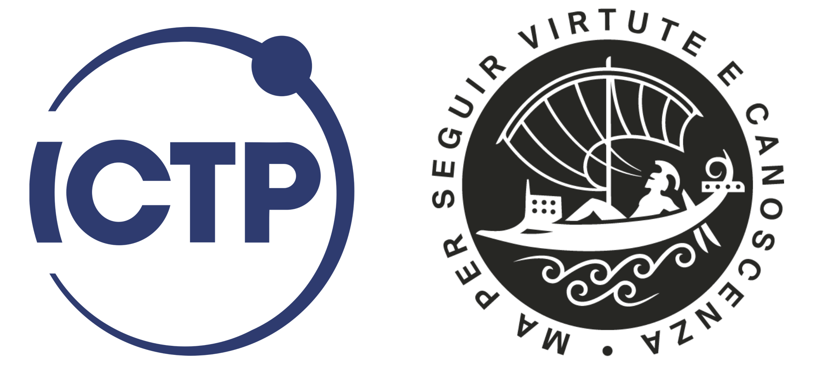
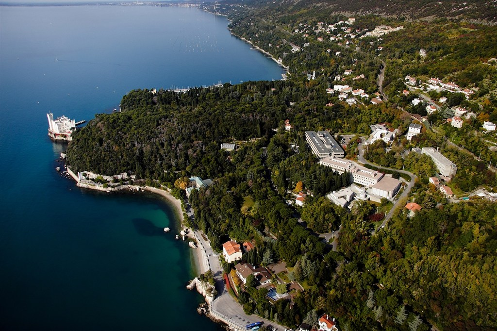
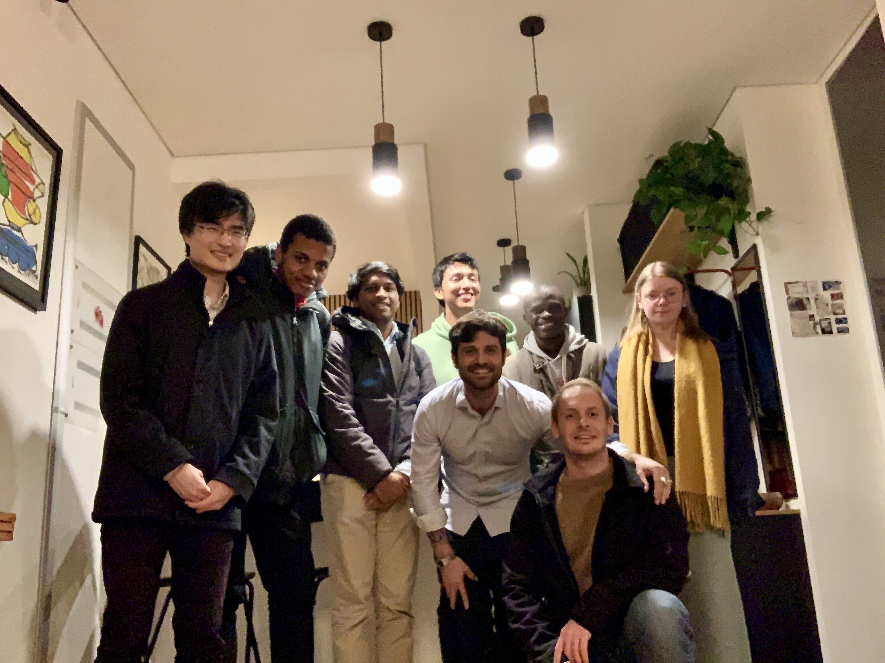
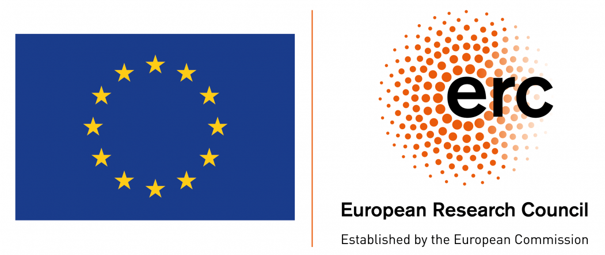

# Hello world

I'm Jean Barbier, a Research Scientist (Tenured Associate Professor) in mathematical physics of signals and learning at the [International Center for Theoretical Physics (ICTP)](https://www.ictp.it/), part of both the [Quantitative Life Science](https://www.ictp.it/qls) and [Mathematics](https://www.ictp.it/math) sections. The ICTP is a [UNESCO institute](https://www.unesco.org/en) whose mission is not only the research excellence, but also teaching and scientific capacity building for the developing world: **ICTP really is a special place to do top research _and_ make a positive impact, worldwide**.

As secondary affiliation I'm part of the [Theoretical and Scientific Data Science group at SISSA](https://datascience.sissa.it/).

The website of my group, the [CHORAL team, can be found here](https://sites.google.com/view/choral-ictp/home?authuser=0).

Both my institutes are located in [Trieste](https://www.google.com/maps/place/Trieste,+Province+of+Trieste,+Italy/@45.6458226,13.7398185,12.42z/data=!4m5!3m4!1s0x477b6b06e4edf533:0x666a2484d4dd2b50!8m2!3d45.6495264!4d13.7768182), a gorgeous Italian city [famous for its quality of life](https://www.italofile.com/best-places-to-live-in-italy-2021/) and known as the "city of science". Among many others, an enjoyable feature of ICTP is its location: it is easy to go for a swim at lunch time :)

The **research interests** of the [CHORAL team](https://sites.google.com/view/choral-ictp/home?authuser=0) are centered around _information processing systems_ such as appearing in machine learning, communication and error-correction, signal processing or computer science. We often study these systems and associated algorithms using statistical physics --the language used to describe _phase transitions_--, its close cousin information theory, and random matrix theory. We try to precisely quantify what is the optimal performance one can aim for when processing (big) data, as well as how close to optimality one can operate when using _computationally efficient_ algorithms. 

To contact me use **jbarbier@ictp.it**

You can find a **short CV** [here](./docs/cv.pdf). In a sentence: prior to joining ICTP I did my PhD at [École Normale Supérieure of Paris](https://www.ens.psl.eu/en) with [Florent Krzakala](https://florentkrzakala.com), followed by a postdoc at [EPFL in Lausanne](https://www.epfl.ch/en/) with [Nicolas Macris](https://people.epfl.ch/nicolas.macris). My research is funded by the [European Research Council](https://erc.europa.eu/news/erc-2021-starting-grants-results?fbclid=IwAR0-AB0MH9WFvlv3Ynp9Z6EMXy_0igRVLsIAiUlB7h79ftnLslV5Pxv_Qp8).

All **my articles** can be found through my [google scholar](https://scholar.google.com/citations?user=yeE5qqIAAAAJ&hl=en).

I am part of the editorial boards of the [Transactions on Machine Learning Research](https://jmlr.org/tmlr/index.html) and of the [Advances in Theoretical and Mathematical Physics](https://www.intlpress.com/site/pub/pages/journals/items/atmp/_home/_main/index.php). Do not hesitate to send your papers there! 

A "wide audience" video on physics and information processing systems on [Youtube](https://www.youtube.com/watch?v=q1VO5dmymFM&t=5s&ab_channel=ICTPMathematics). In order to go further on the links between statistical physics and inference without having to read a full research paper, check this [perspective article](https://arxiv.org/pdf/2010.14863.pdf). 

A conference I particularly enjoy to organize every year together with an amazing team of friends is [Youth in High-Dimensions](http://indico.ictp.it/event/9596/overview). It showcases excellent young researchers working on high-dimensional statistics in a broad sense.

For **prospective students**, please check regularly the openings in the PhD program in [Theoretical and Scientific Data Science at SISSA](https://datascience.sissa.it/phd-in-theoretical-and-scientific-data-science) or directly contact me. For Master Theses, please contact me directly.

Here is a list of the current active members of the [CHORAL team](https://sites.google.com/view/choral-ictp/home?authuser=0): 
+ Daria Tieplova (postdoc)
+ Francesco Camilli (postdoc)
+ Mauro Pastore (postdoc)
+ Minh Toan Nguyen (postdoc)
+ Gibbs Nwemadji (PhD student)
+ Rudy Skerk (PhD student)
+ Ali Hussaini (PhD student)
+ Eleonora Bergamin (MSc student, visitor)

as well as the past members:
+ Manuel Saenz (postdoc, now Prof. at Nottingham University)
+ Tianqi Hou (PhD student, now at Huawei)
+ Anas Rahman (postdoc)
+ Koki Okajima (PhD student, visitor)
+ Rodrigo Perrez (MSc student, visitor)

Few quotes I find particularly relevant (the two last are wrongly attributed to Albert Einstein, yet I like them):

> An expert is a person who has found out by his own painful experience all the mistakes that one can make in a very narrow field. -- Niels Bohr quoted by Eward Teller in LIFE magazine (6 September 1954).

> Physics is like sex: sure, it may give some practical results, but that's not why we do it. -- Richard Feynman

> If you can't explain it simply, you don't understand it well enough. -- [Probably based on a similar quote about explaining physics to a barmaid by Ernest Rutherford](https://en.wikiquote.org/wiki/Albert_Einstein#Misattributed)

> Everything should be made as simple as possible, but not simpler. -- The (long) story of that quote can be found [here](https://quoteinvestigator.com/2011/05/13/einstein-simple/)

In addition to science, I also enjoy a lot electronic music ([some musical experiments from my previous life](https://soundcloud.com/junkosaur) and [from my current one](https://soundcloud.com/jean-barbier-409727380/entropie-8-rsb)), and pretty much any mean of riding/gliding snow, water or air. I also love holding my breath while free diving.
  
# ERC project CHORAL: Computational Hardness Of RepresentAtion Learning

I feel honoured to be a recipient of a **Starting Grant in mathematics from the [European Research Council](https://erc.europa.eu/news/erc-2021-starting-grants-results?fbclid=IwAR0-AB0MH9WFvlv3Ynp9Z6EMXy_0igRVLsIAiUlB7h79ftnLslV5Pxv_Qp8)**. 

[CHORAL](https://sites.google.com/view/choral-ictp/home?authuser=0) will develop novel statistical tools to better quantify the performance of neural networks trained from structured data. It will combine random matrix theory, statistical mechanics and information theory, and will blend physics together with mathematically rigorous approaches. Neural nets are amazingly powerful machines, but their theoretical understanding remains limited when compared to their evergrowing applications in science and technology. A related problem of fundamental interest to machine learning that the project will focus on is of "dictionary learning". 

Please check my [latest articles](https://scholar.google.com/citations?user=yeE5qqIAAAAJ&hl=en) and the [group website](https://sites.google.com/view/choral-ictp/home?authuser=0) to get a sense of what CHORAL is about. See also a [short article about the project](https://www.ictp.it/about-ictp/media-centre/news/2022/1/jean-barbier-erc.aspx).

<!--- Do not hesitate to contact me to inquire about postdoc opening. The ideal candidate has a background in at least one or two of the following disciplines:

* Statistical mechanics, disordered systems / spin glasses (from a mathematics or physics perspective)
* High-dimensional statistics and probability 
* Information theory
* Theoretical machine learning, theory of gradient-based dynamics
* Theory of (approximate) message passing algorithms
* Random matrix theory

As part of the ICTP community, the postdoc eager to help will also have many opportunities for capacity building in developing countries (but not only) through organization of events, travels and networking, teaching etc. 

It is also a great moment to join the Trieste (data) science community thanks to the newly created [Data Science & Artificial Intelligence Institute](https://www.ictp.it/about-ictp/media-centre/news/2021/4/data-science-institute-mou.aspx), see also [here](https://www.sissa.it/news/data-science-artificial-intelligence-institute-born). 

[Here is the call for application](./docs/QLS Postdoctoral call 2022 ERC.pdf).

**PhD positions on the project are available too** and are funded through the PhD program in [Theoretical and Scientific Data Science at SISSA](https://datascience.sissa.it/phd-in-theoretical-and-scientific-data-science) (or contact me directly to discuss other opportunities).--> 
 

